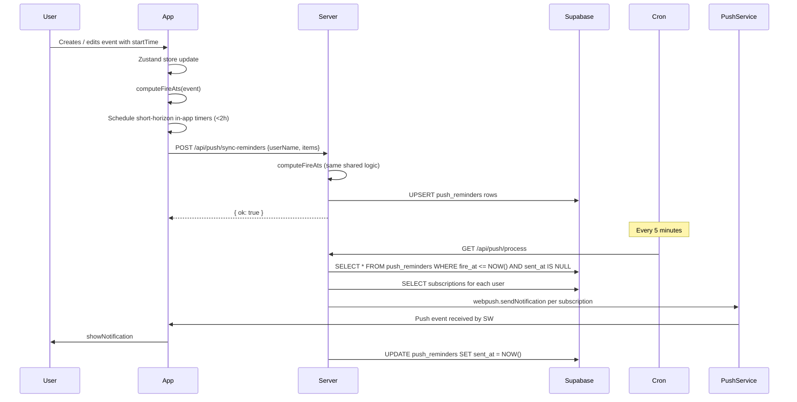
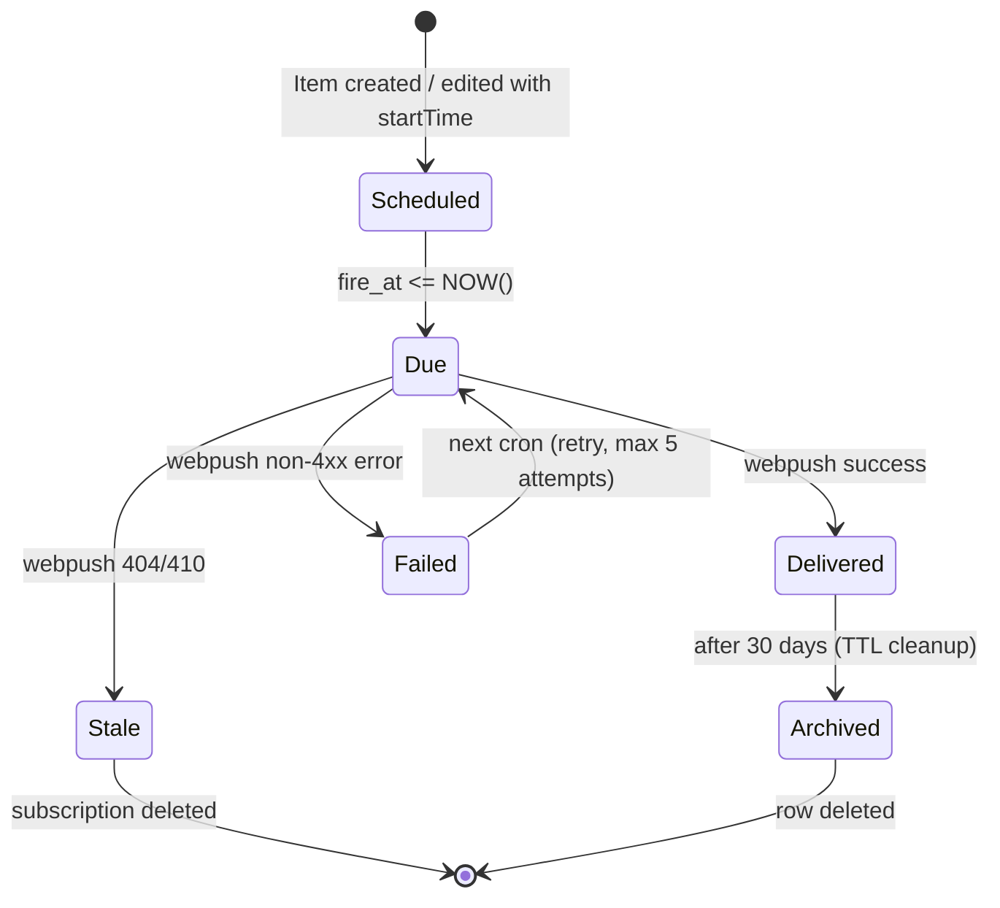

# SeMa — Notification Architecture

> Status: Design document updated after Stage 1 implementation.
> Date: 2026-07-22
> Author: Architecture review for production readiness
> Stage 1: implemented locally, pending production migration approval.

---

## Table of Contents

1. [Current Architecture](#1-current-architecture)
2. [Problems Found](#2-problems-found)
3. [Proposed Architecture](#3-proposed-architecture)
4. [Data Flow](#4-data-flow)
5. [Reminder Lifecycle](#5-reminder-lifecycle)
6. [Push Lifecycle](#6-push-lifecycle)
7. [Synchronization Lifecycle](#7-synchronization-lifecycle)
8. [Service Worker Responsibilities](#8-service-worker-responsibilities)
9. [Server Responsibilities](#9-server-responsibilities)
10. [Client Responsibilities](#10-client-responsibilities)
11. [Future Native App Migration](#11-future-native-app-migration)
12. [Security Considerations](#12-security-considerations)
13. [Performance Considerations](#13-performance-considerations)
14. [Implementation Roadmap](#14-implementation-roadmap)
15. [Quick Wins](#15-quick-wins)

---

## 1. Current Architecture

SeMaCalendar runs two independent notification engines simultaneously:

### 1a. In-app engine (`useNotifications`)

- Runs entirely in the browser tab using `setTimeout`
- Reads from Zustand store state directly
- Schedules three reminders per timed item: previous day at 20:00, 1 hour before, 5 minutes before
- Focus activities use a single user-configured offset (at_time / 10 min / 30 min / 1 hour)
- Re-schedules on every store state change and every tab visibility change
- Fires `new Notification(...)` directly — requires permission, only works while tab is open

### 1b. Push engine (`usePushNotifications` + server)

- Registers `/sw.js` as a Service Worker on every app page load
- Stores `PushSubscription` objects in Supabase `push_subscriptions` table
- Client calls `POST /api/push/sync-reminders` with all future-dated items
- Server stores reminder rows in Supabase `push_reminders` table
- External cron (cron-job.org) calls `GET /api/push/process` every 5 minutes
- Cron reads due unsent reminders, sends via `web-push` (VAPID), marks as sent

### 1c. Supabase tables (inferred)

```
push_subscriptions
  id, couple_id, user_name, endpoint, p256dh, auth, updated_at

push_reminders
  id, couple_id, user_name, item_id, item_type, fire_at, title, message, sent_at
```

### 1d. Service Worker (`/public/sw.js`)

- Handles `push` events → calls `showNotification`
- Handles `notificationclick` → focuses existing window or opens `/`
- Handles `pushsubscriptionchange` → attempts auto-renewal

### 1e. Sources that generate reminders

| Source | In-app | Push |
|--------|--------|------|
| Calendar events (with startTime) | Yes | Yes |
| Todos (incomplete, with startTime) | Yes | Yes |
| Goals (incomplete, with startTime) | Yes | Yes |
| Wishlist items (incomplete, with startTime) | Yes | Yes |
| Countdowns | Yes | Yes |
| Focus activities (with time + reminder) | Yes | Yes |
| Finance month-end | No | Yes (separate route) |

---

## 2. Problems Found

### Critical Bugs

#### BUG-1: `pushsubscriptionchange` saves `userName: null`

**File:** `public/sw.js` line 44

```js
body: JSON.stringify({ subscription: sub.toJSON(), userName: null }),
```

When the browser auto-renews a push subscription (common after 60–90 days, or after a browser update), the Service Worker handles `pushsubscriptionchange` and saves the renewed subscription with `userName: null`. The `POST /api/push/subscribe` handler rejects requests without a `userName`. This silently orphans the renewed subscription. The user continues to believe push is enabled, but all future pushes fail silently.

**Impact:** After ~60-90 days, all push notifications stop working for the affected device with no user-visible error.

---

#### BUG-2: No unique constraint on `push_reminders`

**File:** `src/app/api/push/sync-reminders/route.ts`

The sync flow is: delete unsent rows → insert new rows. This is not atomic. If two sync calls happen simultaneously (e.g. Mateo saves an event while Seval's tab is also syncing), duplicate rows can be inserted. The `push_reminders` table has no `UNIQUE(user_name, item_id, fire_at)` constraint. Result: the same reminder fires multiple times — the user receives duplicate notifications.

**Impact:** Duplicate push notifications under concurrent sync conditions.

---

#### BUG-3: `allOk` marks partial failures as permanent failures

**File:** `src/app/api/push/process/route.ts` lines 114–151

If a user has 2+ subscriptions (e.g. phone + laptop) and one delivers successfully but the other fails with a transient error (5xx from push service), `allOk = false` and the reminder is NOT marked as `sent_at`. The next cron run will re-process it and deliver duplicates to the devices that already received it successfully.

**Impact:** Duplicate push notifications on partially-failed cron runs.

---

#### BUG-4: In-app `setTimeout` is unreliable for long-duration reminders

**File:** `src/hooks/useNotifications.ts`

The "previous day at 8PM" reminder can be up to 48 hours in the future. `setTimeout` is not designed for delays this long. Modern browsers throttle background timers aggressively (Chrome limits to 1 Hz after 5 minutes of background, Firefox may suspend entirely). A reminder set for 28 hours will almost certainly never fire via `setTimeout` if the tab is inactive.

**Impact:** The longest reminder (day-before at 8PM) silently fails in all real-world background usage.

---

#### BUG-5: `pushsubscriptionchange` VAPID key may be null

**File:** `public/sw.js` line 40

```js
applicationServerKey: event.oldSubscription?.options?.applicationServerKey
```

`PushSubscription.options.applicationServerKey` is defined in the spec, but some browsers return `null` for subscriptions created before the VAPID key was accessible. If it is null, `pushManager.subscribe()` throws and the `.catch(() => {})` silently swallows the error. The subscription is not renewed. Same outcome as BUG-1.

**Impact:** Subscription renewal fails silently on some browsers/devices.

---

### Medium Priority Issues

#### MED-1: Double notification when tab is open

When both systems are running (which is always), a user with push enabled AND the app open in a tab receives:
- An in-app `Notification` from `useNotifications`
- A push notification from the server

Both fire at approximately the same time, causing duplicate alerts.

---

#### MED-2: No authentication on `/api/push/send`

**File:** `src/app/api/push/send/route.ts`

The `POST /api/push/send` endpoint sends a real push notification to any user. It has no authentication, no CORS restriction, and accepts `userName` from the request body. Anyone who knows the URL can push arbitrary notifications to Mateo or Seval.

---

#### MED-3: `REMINDER_LABELS` mapping is positional and fragile

**File:** `src/app/api/push/sync-reminders/route.ts`

```ts
const REMINDER_LABELS: Record<number, string> = {
  0: '5 min before',
  1: '1 hour before',
  2: 'tomorrow',
}
const offsetIndex = fireAts.length - 1 - i
```

This reverse-index approach assumes `fireAts` always has exactly 3 entries in a specific order. If any caller passes 1 or 2 fireAts (e.g. events less than 1 hour away), the labels become wrong. Focus activities deliberately pass 1 fireAt with a `customMessage`, which bypasses the bug, but the base path is fragile.

---

#### MED-4: Reminder sync sends both users' data from one user's store

**File:** `src/hooks/usePushNotifications.ts` — `syncBothUsers`

When Mateo edits an event, the client reads from the local Zustand store and syncs reminders for both `mateo` and `seval`. However, Seval's Supabase data may not be fully reflected in Mateo's local store at that moment (Supabase realtime sync has latency). This means Seval's reminder rows might be based on stale data from Mateo's perspective.

---

#### MED-5: No TTL / cleanup on `push_reminders`

Sent reminder rows (`sent_at IS NOT NULL`) are never deleted. The table grows unboundedly. Over 2–3 years this is a minor issue for a 2-person app but becomes a scaling problem as a multi-couple app.

---

#### MED-6: Notification tap does not deep-link to the specific item

**File:** `src/app/api/push/process/route.ts` lines 118–119

```ts
const notifUrl = r.item_type === 'finance-month-end' ? '/plans' : '/together'
```

All push notifications tap-to `/together` (or `/plans` for finance). There is no deep-linking to the specific event, todo, goal, etc. that triggered the notification.

---

#### MED-7: Inconsistent reminder messages between in-app and push

The in-app engine (`useNotifications`) and the push engine (`usePushNotifications`) compute reminder messages with slightly different formatting. If both fire, the user sees two differently-worded notifications for the same event.

---

### Low Priority Issues

#### LOW-1: SW `badge` uses 192px icon (too large)

The W3C spec expects `badge` to be a small monochrome icon (typically 24px–96px). Using `icon-192.png` as the badge will render incorrectly on some Android devices.

#### LOW-2: `renotify: true` on every notification

Every notification uses `renotify: true`, meaning Android will vibrate and alert the user even if a notification with the same `tag` already exists on screen. For rapid sequences this is noisy.

#### LOW-3: No maximum retry count for failing reminders

A subscription that returns a persistent non-404/410 error (e.g. the push service returns 503) will be retried on every cron run forever. There is no `retry_count` or `failed_at` column.

#### LOW-4: `couple_id` hardcoded as `'sema'`

Every DB row has `couple_id: 'sema'` hardcoded in the API routes. This is fine for a 2-person app but blocks multi-couple evolution.

#### LOW-5: No SW update/activation strategy

The SW is registered without `updateViaCache: 'none'` or a `skipWaiting()` call. Old SW versions can persist indefinitely, potentially leaving users on a stale push handler.

---

## 3. Proposed Architecture

The core principle: **one scheduling truth, two delivery methods**.

```
                       ┌─────────────────────────────────┐
                       │         Zustand Store            │
                       │  (events, todos, goals, etc.)   │
                       └────────────┬────────────────────┘
                                    │ on any change
                                    ▼
                       ┌─────────────────────────────────┐
                       │      Reminder Calculator         │
                       │  Single shared function that     │
                       │  computes all fireAt times       │
                       └────────────┬────────────────────┘
                                    │
               ┌────────────────────┴────────────────────┐
               ▼                                         ▼
  ┌────────────────────────┐             ┌───────────────────────────┐
  │   In-app Scheduler     │             │   Server Reminder Sync    │
  │  (tab open only)       │             │  (background delivery)    │
  │  setTimeout (short)    │             │  Supabase push_reminders  │
  │  max 2 hours ahead     │             │  cron every 5 min         │
  └────────────────────────┘             └───────────────────────────┘
```

### Key design decisions

1. **Shared `computeFireAts` function** — single source of truth for reminder timing, used by both the in-app scheduler and the push sync. Lives in `/lib/notifications.ts`.

2. **In-app scheduler only handles short-horizon reminders** — In-app timers are only set for items firing within the next 2 hours. Everything else is left to push.

3. **Deduplication gate** — Before showing an in-app notification, check if push was already delivered for the same `(item_id, fire_at)` tuple (via a small in-memory or `sessionStorage` set). Before the server fires a push, check if the tab is active (via push payload flag, SW checks visibility).

4. **Idempotent reminder rows** — `push_reminders` gets a `UNIQUE(couple_id, user_name, item_id, fire_at)` constraint. Sync uses upsert, not delete+insert.

5. **Per-subscription sent tracking** — Change `sent_at` from a single timestamp to a JSONB column `sent_to: { endpoint_hash: ISO }`. A reminder is only marked globally sent when all subscriptions have been delivered to (or confirmed stale). This fixes BUG-3.

6. **SW stores userName** — On subscribe, the userName is stored in SW's `indexedDB` (or `caches`). On `pushsubscriptionchange`, the SW reads the stored userName and re-saves correctly. Fixes BUG-1 and BUG-5.

7. **Authentication on `/api/push/send`** — Require the same `CRON_SECRET` bearer token, or a separate `PUSH_SEND_SECRET`.

8. **Deep-link URLs** — Each `push_reminders` row stores a `deep_link` column: `/together?date=YYYY-MM-DD` for events, `/planner` for focus activities, etc. The SW uses this URL on notification click.

9. **Row TTL** — A separate cron (weekly) deletes `push_reminders` rows where `sent_at < NOW() - INTERVAL '30 days'`.

---

## 4. Data Flow



---

## 5. Reminder Lifecycle



---

## 6. Push Lifecycle

```mermaid
stateDiagram-v2
    [*] --> Unsupported: No SW or PushManager
    [*] --> Default: SW registered, no permission
    Default --> Granted: Notification.requestPermission() = granted
    Default --> Denied: Notification.requestPermission() = denied
    Granted --> Subscribed: PushManager.subscribe() + saved to DB
    Subscribed --> Renewed: pushsubscriptionchange (auto)
    Renewed --> Subscribed: re-saved with userName from SW storage
    Subscribed --> Default: user disables / unsubscribes
    Denied --> Default: user enables in browser settings (manual)
```

---

## 7. Synchronization Lifecycle

The current "sync on every store change" approach works but is noisy — it can trigger dozens of syncs per minute during bulk imports.

**Proposed:** debounced sync with 3-second window.

```
store change → wait 3s (debounce) → syncBothUsers()
                                   → server upserts reminders
                                   → cron picks up at next 5-min boundary
```

Maximum additional latency: 3s debounce + up to 5 min cron window = ~5m3s. Acceptable for a reminder app where fire_at precision is already ±5 min.

---

## 8. Service Worker Responsibilities

### Current
- Handle `push` → show notification
- Handle `notificationclick` → focus/open app
- Handle `pushsubscriptionchange` → attempt renewal (broken, see BUG-1)

### Proposed additions
- **Store userName in SW storage** (`indexedDB` or `caches.open`) so `pushsubscriptionchange` can re-save with the correct user
- **Suppress duplicate notification** — on `push` event, check a small `sessionStorage`-equivalent in the SW (using `indexedDB`) for `(item_id, fire_at)` tuples delivered in the last 10 minutes
- **Update strategy** — add `skipWaiting()` + `clients.claim()` and `updateViaCache: 'none'` on registration so new SW versions activate immediately
- **Deep-link routing** — use `data.url` from push payload for `notificationclick`, falling back to `/`
- **Badge icon** — use a dedicated small monochrome `/icons/badge-96.png` instead of the 192px icon

---

## 9. Server Responsibilities

### Current
- `POST /api/push/subscribe` — save subscription
- `DELETE /api/push/subscribe` — remove subscription
- `GET /api/push/status` — check subscription exists
- `POST /api/push/sync-reminders` — replace reminder rows
- `GET /api/push/process` — cron delivery
- `POST /api/push/send` — instant send (unauthenticated)
- `POST /api/push/finance-month-end` — schedule finance reminder

### Proposed changes
- **`sync-reminders`**: switch from delete+insert to upsert with unique constraint; add `deep_link` column; return diff summary
- **`process`**: per-subscription sent tracking; `retry_count` column; skip if `retry_count >= 5`
- **`send`**: add `PUSH_SEND_SECRET` bearer authentication
- **New `GET /api/push/cleanup`** (weekly cron): delete `push_reminders` where `sent_at < NOW() - 30 days`
- **Shared `computeFireAts`**: move to `/lib/notifications.ts`, import in both client hooks and server routes

---

## 10. Client Responsibilities

### Current
- Register SW, subscribe to push, sync reminders on any store change
- Run in-app scheduler for all future items

### Proposed changes
- **In-app scheduler**: only set timers for items firing within 2 hours; skip items that already have a push subscription active
- **Debounced sync**: 3-second debounce on `syncBothUsers`
- **userName in SW**: after successful subscribe, post a message to the SW: `sw.postMessage({ type: 'SET_USER', userName })`; SW writes to `indexedDB`
- **Dedup gate**: after in-app notification fires, write `(item_id, fire_at)` to `sessionStorage`; push handler in SW checks the same set

---

## 11. Future Native App Migration

The architecture is designed to be extractable to Capacitor (iOS/Android) or React Native without rewriting core logic.

### Migration path

```
Phase 1 (now):    Web Push via VAPID — Android PWA full support
                                      — iOS 16.4+ PWA support

Phase 2 (later):  Capacitor wraps the Next.js app
                  → replace PushManager with @capacitor/push-notifications
                  → replace /sw.js handler with Capacitor push handler
                  → server sends via web-push (Android) OR APNs (iOS)

Phase 3 (future): Full native
                  → Firebase Cloud Messaging (Android)
                  → APNs (iOS)
                  → Server sends via FCM Admin SDK
```

### What stays the same across all phases
- `push_subscriptions` table — add `platform` column (`web` / `fcm` / `apns`)
- `push_reminders` table — unchanged
- `computeFireAts` logic — unchanged
- Cron process route — add platform-aware send dispatch

### Capacitor-specific notes
- `@capacitor/push-notifications` replaces `usePushNotifications` hook
- The device token (FCM token or APNs device token) replaces the Web Push subscription object
- The server must dispatch via FCM Admin SDK or APNs HTTP/2 API instead of `web-push`
- The SW is not used in Capacitor; the native SDK handles notification display

---

## 12. Security Considerations

| Issue | Severity | Fix |
|-------|----------|-----|
| `/api/push/send` unauthenticated | High | Add `PUSH_SEND_SECRET` bearer check |
| `CRON_SECRET` dev fallback allows | Medium | Enforce in production via env check |
| `couple_id: 'sema'` hardcoded | Low | Add to env / session context |
| VAPID keys in env | OK | Standard practice, keep in `.env.local` |
| Subscription endpoint exposed in logs | Low | Truncate to last 40 chars (already done) |
| No rate limiting on sync endpoint | Medium | Add per-user rate limit (1 req/3s) |

---

## 13. Performance Considerations

| Concern | Current | Proposed |
|---------|---------|----------|
| Sync frequency | Every store change (potentially 10s/sec during typing) | Debounced 3s |
| Cron batch size | 100 reminders | 100 (fine for 2 users) |
| DB cleanup | Never | Weekly cron after 30 days |
| Subscription fetch in process | SELECT per cron run | Add `created_at` index |
| `push_reminders` query | Full table scan | Add `INDEX(fire_at, sent_at)` |

---

## 14. Implementation Roadmap

### Priority 1 — Fix critical delivery bugs (must do before scale)

**Step 1.1 — Fix `pushsubscriptionchange` (BUG-1, BUG-5)**

- Why: Silent subscription expiry kills all notifications after ~90 days
- Files: `public/sw.js`, `src/hooks/usePushNotifications.ts`
- Changes:
  - On successful subscribe, `sw.postMessage({ type: 'SET_USER', userName })`
  - SW: listen for message, store in `indexedDB`
  - SW `pushsubscriptionchange`: read userName from `indexedDB`, pass to POST
- DB change: none
- API change: none
- Risk: Low — additive change
- Complexity: Low

**Step 1.2 — Add unique constraint on `push_reminders` (BUG-2)**

- Why: Prevents duplicate push notifications from concurrent syncs
- Files: Supabase migration only
- Changes: `ALTER TABLE push_reminders ADD UNIQUE(couple_id, user_name, item_id, fire_at)`
- DB change: 1 unique index
- API change: `sync-reminders` switches to upsert
- Risk: Low — if duplicates already exist, migration will fail; pre-clean first
- Complexity: Low

**Step 1.3 — Fix partial-failure marking (BUG-3)**

- Why: Prevents duplicate notifications after transient failures
- Files: `src/app/api/push/process/route.ts`
- Changes: track which endpoints succeeded per reminder; only re-send to failed endpoints on retry; add `retry_count` column
- DB change: add `retry_count INTEGER DEFAULT 0` to `push_reminders`; add `failed_at` column
- Risk: Medium — requires DB migration and process route logic change
- Complexity: Medium

---

### Priority 2 — Fix security and authentication

**Step 2.1 — Authenticate `/api/push/send`**

- Why: Prevents arbitrary notification injection
- Files: `src/app/api/push/send/route.ts`
- Changes: add `isAuthorized()` check using `PUSH_SEND_SECRET` env var
- DB change: none
- Risk: Low — only affects test push from `NotificationSetup`; must update client to pass token
- Complexity: Low

**Step 2.2 — Rate-limit `/api/push/sync-reminders`**

- Why: Prevents accidental or malicious sync floods
- Files: `src/app/api/push/sync-reminders/route.ts`
- Changes: add simple in-memory or Supabase-backed rate limit (1 call/3s per userName)
- Risk: Low
- Complexity: Low

---

### Priority 3 — Fix in-app scheduler reliability

**Step 3.1 — Extract shared `computeFireAts` to `/lib/notifications.ts`**

- Why: Single source of truth, prevents server/client drift
- Files: new `src/lib/notifications.ts`, `src/hooks/useNotifications.ts`, `src/hooks/usePushNotifications.ts`, `src/app/api/push/sync-reminders/route.ts`
- Changes: move all timing logic to the shared lib, import everywhere
- Risk: Low — pure refactor, no behavior change
- Complexity: Medium (touching 4 files)

**Step 3.2 — Cap in-app timers at 2-hour horizon**

- Why: `setTimeout` is unreliable beyond ~2 hours in background tabs
- Files: `src/hooks/useNotifications.ts`
- Changes: skip scheduling any timer with `delay > 2 * 60 * 60 * 1000`
- Risk: None — long-horizon reminders are already handled by push
- Complexity: Very Low

**Step 3.3 — Debounce `syncBothUsers`**

- Why: Reduce unnecessary API calls during fast edits
- Files: `src/hooks/usePushNotifications.ts`
- Changes: wrap `syncBothUsers` in a 3-second debounce using `useRef` timer
- Risk: Very Low — at most 3s extra latency on reminder rows
- Complexity: Very Low

---

### Priority 4 — Eliminate double notifications

**Step 4.1 — Deduplication gate**

- Why: Users receive the same notification twice when tab is open
- Files: `src/hooks/useNotifications.ts`, `public/sw.js`
- Changes:
  - Before firing in-app: write `sema-notif-${item_id}-${fire_at}` to `sessionStorage`
  - SW push handler: check `sessionStorage` for same key; if exists within 10 minutes, suppress the in-app style show (or vice versa — decide which source wins)
  - Simplest approach: in-app always fires; push payload includes `suppress_if_active: true`; SW checks `clients.matchAll()` for focused windows before `showNotification`
- Risk: Medium — requires SW and client coordination
- Complexity: Medium

---

### Priority 5 — Deep-link notifications

**Step 5.1 — Add `deep_link` to push_reminders**

- Why: Tapping a notification should open the relevant screen
- Files: `src/app/api/push/sync-reminders/route.ts`, `src/app/api/push/process/route.ts`, `public/sw.js`
- Changes:
  - `sync-reminders`: compute `deep_link` per item type (e.g. `/together?date=2026-08-01` for events)
  - `process`: include `url: deep_link` in push payload
  - SW `notificationclick`: use `notification.data.url`
- DB change: add `deep_link TEXT` column to `push_reminders`
- Risk: Low
- Complexity: Low

---

### Priority 6 — Maintenance and cleanup

**Step 6.1 — Weekly cleanup cron**

- Why: `push_reminders` grows unboundedly
- Files: new `src/app/api/push/cleanup/route.ts`
- Changes: `DELETE FROM push_reminders WHERE sent_at < NOW() - INTERVAL '30 days'`
- Risk: Very Low
- Complexity: Very Low

**Step 6.2 — SW update strategy**

- Why: Old SW versions persist indefinitely
- Files: `public/sw.js`, `src/hooks/usePushNotifications.ts`
- Changes:
  - SW: add `self.addEventListener('install', () => self.skipWaiting())`
  - SW: add `self.addEventListener('activate', e => e.waitUntil(clients.claim()))`
  - Registration: add `updateViaCache: 'none'`
- Risk: Low
- Complexity: Very Low

---

## 15. Quick Wins

### Critical bugs (must fix before any growth)

| # | Issue | File | Effort |
|---|-------|------|--------|
| BUG-1 | `pushsubscriptionchange` sends userName: null | `sw.js` | 1 hour |
| BUG-2 | No unique constraint on push_reminders | DB migration | 30 min |
| BUG-3 | allOk marks partial failures permanently | `process/route.ts` | 2 hours |

### Medium priority (fix in next sprint)

| # | Issue | File | Effort |
|---|-------|------|--------|
| MED-1 | Double notification when tab open | `sw.js` + `useNotifications.ts` | 3 hours |
| MED-2 | `/api/push/send` unauthenticated | `send/route.ts` | 30 min |
| MED-3 | Fragile REMINDER_LABELS positional mapping | `sync-reminders/route.ts` | 1 hour |
| MED-6 | No deep-link on notification tap | `process/route.ts` + `sw.js` | 2 hours |

### Low priority improvements (nice to have)

| # | Issue | File | Effort |
|---|-------|------|--------|
| LOW-1 | Badge icon too large | `sw.js` | 15 min |
| LOW-2 | `renotify: true` too aggressive | `sw.js` | 15 min |
| LOW-3 | No retry count limit | DB + `process/route.ts` | 1 hour |
| LOW-5 | No SW update strategy | `sw.js` | 30 min |

---

---

## 16. Stage 1 Implementation — Status

Stage 1 ("Notification Stabilization") has been implemented locally. Migration 0003 is written but **not yet applied to production**.

### Bug resolution

| Bug | Status | Resolution |
|-----|--------|------------|
| BUG-1: `pushsubscriptionchange` saves userName: null | **Fixed** | SW stores userName in IndexedDB; `pushsubscriptionchange` reads it before re-subscribing |
| BUG-2: No unique constraint on push_reminders | **Fixed** | `reminder_key` column + partial unique index; sync-reminders uses upsert on conflict |
| BUG-3: allOk marks partial failures permanently | **Fixed** | Per-subscription `delivered_endpoints` JSONB array; cron only retries pending subs |
| BUG-4: `setTimeout` unreliable >2h | Open (Phase 2) | In-app scheduler unchanged; long reminders rely on push |
| BUG-5: VAPID key may be null on renewal | **Fixed** | Explicit null check; clear warning logged; falls back to manual reconnect |

| Issue | Status | Resolution |
|-------|--------|------------|
| MED-2: `/api/push/send` unauthenticated | **Fixed** | `PUSH_SEND_SECRET` bearer auth; production fails closed (503) if secret missing |
| MED-3: Fragile REMINDER_LABELS positional mapping | **Fixed** | Replaced with stable label-based `ReminderEntry` + `LABEL_PREFIX` server map |
| MED-6: No retry limit | **Fixed** | `retry_count` tracked; permanently failed after 5 attempts |
| MED-4: Stale Zustand data in syncBothUsers | Open (Phase 2) | Acknowledged; acceptable for 2-user app |
| LOW-2: `renotify: true` aggressive | **Fixed** | Changed to `renotify: false` in sw.js |
| LOW-3: No retry count limit | **Fixed** | `retry_count` + `failed_permanently_at` columns |
| LOW-5: No SW update strategy | **Fixed** | `skipWaiting()` + `clients.claim()` + `updateViaCache: 'none'` |

### New files / changed files

| File | Change |
|------|--------|
| `public/sw.js` | Rewritten: IndexedDB identity, `pushsubscriptionchange` fix, `skipWaiting`, `renotify: false` |
| `src/hooks/usePushNotifications.ts` | Rewritten: `ReminderEntry` interface, `reminder_key` labels, `endpoint` state, `notifySWOfUser` |
| `src/app/api/push/send/route.ts` | Added `PUSH_SEND_SECRET` auth; production fails closed (503) when secret missing |
| `src/app/api/push/test/route.ts` | New: device-authenticated test push (endpoint ownership check, no secret needed) |
| `src/app/api/push/sync-reminders/route.ts` | Rewritten: `reminder_key` upsert, `delivered_endpoints: []` reset, rate limiting, known-user validation |
| `src/app/api/push/process/route.ts` | Per-subscription `delivered_endpoints` tracking; CRON_SECRET fails closed in production |
| `src/app/api/push/finance-month-end/route.ts` | Switched to `reminder_key` upsert |
| `src/components/NotificationSetup.tsx` | Test button now calls `/api/push/test` with device `endpoint` |
| `supabase/migrations/0003_notification_stability.sql` | New: `reminder_key`, `retry_count`, `last_error`, `failed_permanently_at`, `delivered_endpoints`, `push_sync_log` |

### Known remaining limitations (not blocking Stage 1)

- **MED-1 double notification**: Users with both the tab open and push active receive two notifications. Fix requires push → SW checking for focused window before `showNotification`. Deferred to Priority 4.
- **MED-4 stale Zustand data**: Seval's reminders are synced from Mateo's local store state. Fine for 2-person app; requires server-side reminder computation for multi-couple.
- **MED-5 no TTL on push_reminders**: Sent rows accumulate. Acceptable at current scale; add cleanup cron later.
- **No deep-linking**: Notification taps go to `/together` (or `/plans`). Deep-links deferred to Priority 5.
- **sync-reminders ownership check is non-fatal**: Endpoint mismatch is logged but sync still proceeds. This is intentional — the app has no user session auth and syncing is write-only for reminder rows scoped to the stated userName.

---

## 17. Pre-Deployment Checklist

This checklist must be completed in order before deploying Stage 1 to production.

### Step 0 — Verify all env vars are set in Vercel

Required variables (check all exist in Vercel project → Settings → Environment Variables):

```
NEXT_PUBLIC_SUPABASE_URL
NEXT_PUBLIC_SUPABASE_ANON_KEY
SUPABASE_SERVICE_ROLE_KEY
NEXT_PUBLIC_VAPID_PUBLIC_KEY
VAPID_PRIVATE_KEY
VAPID_SUBJECT
CRON_SECRET
PUSH_SEND_SECRET        ← NEW: must be set before deploying
```

`PUSH_SEND_SECRET` must be a strong random secret (min 32 hex chars). Generate with:
```bash
node -e "console.log(require('crypto').randomBytes(32).toString('hex'))"
```

If `PUSH_SEND_SECRET` or `CRON_SECRET` is missing in production, the respective routes return 503 and reject all requests. This is intentional fail-closed behavior.

### Step 1 — Apply migration 0003 to production Supabase

**Do not deploy code before running the migration.** The new `process/route.ts` queries `failed_permanently_at` and `delivered_endpoints` which do not exist in the old schema.

1. Open Supabase dashboard → SQL editor
2. Paste and run `supabase/migrations/0003_notification_stability.sql`
3. Verify with:

```sql
-- Verify all new columns exist
SELECT column_name, data_type, is_nullable, column_default
FROM information_schema.columns
WHERE table_name = 'push_reminders'
  AND column_name IN ('reminder_key','retry_count','last_error','failed_permanently_at','delivered_endpoints')
ORDER BY column_name;

-- Verify push_sync_log table was created
SELECT * FROM push_sync_log;

-- Verify indexes exist
SELECT indexname, indexdef
FROM pg_indexes
WHERE tablename = 'push_reminders'
  AND indexname IN ('push_reminders_reminder_key_uidx','push_reminders_due_idx','push_reminders_user_idx');
```

Expected: 5 columns returned, `push_sync_log` exists, 3 indexes listed.

**Safety notes for migration 0003:**
- All DDL uses `ADD COLUMN IF NOT EXISTS` and `CREATE INDEX IF NOT EXISTS` — safe to re-run if partially applied.
- Adds nullable `reminder_key` (existing rows get NULL — excluded from unique index by `WHERE reminder_key IS NOT NULL`).
- Adds `delivered_endpoints JSONB NOT NULL DEFAULT '[]'` — existing rows get empty array (correct).
- Adds `retry_count INTEGER NOT NULL DEFAULT 0` — existing rows get 0 (correct).
- No existing data is deleted, modified, or lost.
- Legacy rows (null `reminder_key`) remain functional: the cron still delivers them (null is not filtered), and they are cleaned up gradually as items are re-synced by the client.
- Rollback is fully documented at the bottom of the migration file.

**Potential risks:**
- If duplicate reminder_keys already exist from a previous partial implementation (none expected since `reminder_key` column is new), the partial unique index creation would fail. Pre-check:
  ```sql
  SELECT reminder_key, COUNT(*) FROM push_reminders
  WHERE reminder_key IS NOT NULL
  GROUP BY reminder_key HAVING COUNT(*) > 1;
  ```
  Expected: 0 rows.

### Step 2 — Deploy code to Vercel

Deploy the main branch. Both migration and env vars must be complete first.

After deploy, verify the new routes appear in the Vercel function list:
- `/api/push/test` (new)
- All existing routes still listed

### Step 3 — Smoke test on production

Run from the **production app** on a real device (not localhost):

1. **Auth check on /api/push/send:**
   ```bash
   curl -X POST https://sema-calendar.vercel.app/api/push/send \
     -H "Content-Type: application/json" \
     -d '{"userName":"mateo","title":"test","body":"test"}'
   # Expected: 401 Unauthorized
   ```

2. **Auth check with correct secret:**
   ```bash
   curl -X POST https://sema-calendar.vercel.app/api/push/send \
     -H "Authorization: Bearer <PUSH_SEND_SECRET>" \
     -H "Content-Type: application/json" \
     -d '{"userName":"mateo","title":"test","body":"test"}'
   # Expected: 200 { ok: true, sent: N }
   ```

3. **Cron check:**
   ```bash
   curl -X GET https://sema-calendar.vercel.app/api/push/process \
     -H "Authorization: Bearer <CRON_SECRET>"
   # Expected: 200 { ok: true, processed: 0 or N }
   ```

4. **Test push from app UI:**
   - Open Settings on Mateo's device
   - Tap "Send test notification"
   - Background the app
   - Expected: notification arrives within 5 seconds

5. **Sync reminders:**
   - Navigate to the Home page
   - Check Vercel logs — expect: `[sync-reminders] mateo — items: N, future rows: M`
   - Check Supabase `push_reminders` table: new rows should have `reminder_key` populated

6. **Rate limit check:**
   - Trigger two back-to-back navigations; second sync should log `Rate limit hit for mateo`

7. **Cron job (cron-job.org):**
   - Verify cron-job.org is still configured to hit `/api/push/process` every 5 minutes
   - Verify the `Authorization: Bearer <CRON_SECRET>` header is set in the cron job config

### Step 4 — Verify delivery after first cron run with new schema

After a real reminder fires via cron:
```sql
-- Check that sent reminders have sent_at set and delivered_endpoints populated
SELECT id, user_name, reminder_key, fire_at, sent_at, delivered_endpoints, retry_count
FROM push_reminders
WHERE sent_at IS NOT NULL
ORDER BY sent_at DESC
LIMIT 5;
```

Expected: `delivered_endpoints` contains at least one endpoint URL string.

### Rollback procedure

If anything goes wrong after deploy:

1. **Revert code in Vercel:** Redeploy the previous commit via Vercel dashboard.
2. **Rollback migration (if needed — data-safe):**
   ```sql
   DROP TABLE IF EXISTS push_sync_log;
   DROP INDEX IF EXISTS push_reminders_user_idx;
   DROP INDEX IF EXISTS push_reminders_due_idx;
   ALTER TABLE push_reminders
     DROP COLUMN IF EXISTS failed_permanently_at,
     DROP COLUMN IF EXISTS last_error,
     DROP COLUMN IF EXISTS retry_count,
     DROP COLUMN IF EXISTS delivered_endpoints;
   DROP INDEX IF EXISTS push_reminders_reminder_key_uidx;
   ALTER TABLE push_reminders
     DROP COLUMN IF EXISTS reminder_key;
   ```
   This removes only the new columns and tables. All existing reminder rows and subscription data are preserved.
3. **Remove `PUSH_SEND_SECRET` from Vercel** if rolling back to the unauthenticated version — but prefer keeping it set and rolling back only the code.
